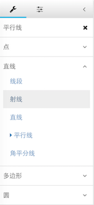
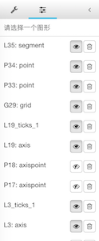

# Geometry Editor

An online geometry editor based on AngularJS and JSXGraph.

[View online demos](http://rhcad.com/#/sketch).

 -  - 

## Features

 - [x] Multiple devices (iOS, Android and PC) and browsers.
 - [x] Snapping points (vertex, glider, intersection and midpoint).
 - [x] Draw shapes interactively.
 - [x] Show and edit properties of shapes.
 - [ ] Load and save.
 - [ ] Undo and redo.

## Build & development

Run `npm install && bower install` to download all dependencies.

Run `grunt serve` for preview and `grunt build` for deploying.

## License

This project is licensed under [GPL v3](http://www.gnu.org/licenses/gpl-3.0.html).

Author: [Zhang Yungui](https://github.com/rhcad).

## Further reading

- [Debug with the unminified version of JSXGraph library](doc/build_jxg.md) (Run `test/jxg.sh`)
- [JSXGraph Homepage](http://jsxgraph.uni-bayreuth.de/wp/)
